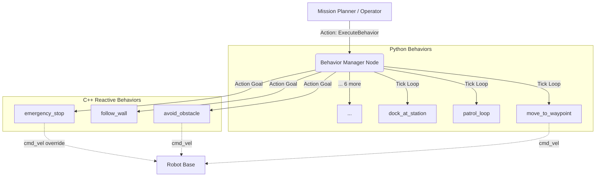

# Acroba Framework

[](https://github.com/ibrahimaniasse/Acroba-project/actions/workflows/ci.yml)
[](https://github.com/ibrahimaniasse/Acroba-project/actions)


A highly modular, action-based behavior orchestration framework for autonomous robotics in ROS 2. 

> **Author's Note**: This repository originally started as a workshop exercise (ACROBA/SIGMA) exploring basic ROS 1 turtlesim concepts. I have completely reconstructed it into a production-grade ROS 2 framework to demonstrate advanced software architecture, inter-node communication, and hybrid C++/Python behavior orchestration. The original workshop code is archived in the `legacy/` directory.

## Overview

The Acroba Framework provides a flexible architecture for robot autonomy. It separates the orchestration logic (the manager) from the execution logic (the behaviors), allowing for dynamic composition of complex missions.

At its core, a central **Behavior Manager** loads plugins dynamically from a YAML registry and exposes a standardized `ExecuteBehavior` action server. This allows higher-level planners or human operators to trigger, monitor, and preempt any behavior through a single, uniform interface.

### Key Features
- **Action-Based Orchestration**: Unified lifecycle management (start, monitor progress, preempt, succeed, fail).
- **Hybrid Language Support**: 
  - **Python 3**: Used for sequential, stateful, or high-level logic (e.g., path following, search patterns).
  - **C++ 17**: Used for high-frequency, reactive, low-latency control loops (e.g., collision avoidance, emergency stops).
- **Declarative Configuration**: Behaviors are registered and parameterized via `behaviors.yaml`.
- **Preemption & Safety**: High-priority reactive behaviors (like `emergency_stop`) can preempt active behaviors instantly.

## Architecture



*(See [Architecture Details](docs/architecture.md) for more depth).*

## The 12 Reusable Behaviors

| Behavior Name | Type | Description |
|---|---|---|
| `move_to_waypoint` | Python | Navigate to a specific (x, y, θ) pose using a proportional controller. |
| `rotate_in_place` | Python | Pure rotation to align with a target heading. |
| `wait_for_trigger` | Python | Block execution until a signal is received on a configured topic. |
| `return_to_home` | Python | Record initial pose and autonomously navigate back to it. |
| `patrol_loop` | Python | Cycle through a defined JSON list of waypoints indefinitely or N times. |
| `search_pattern` | Python | Generate and follow lawnmower or spiral coverage patterns. |
| `follow_path` | Python | Pure-pursuit inspired tracking of a pre-planned `nav_msgs/Path`. |
| `dock_at_station` | Python | Two-phase precision alignment with a simulated docking station. |
| `formation_hold` | Python | Maintain a relative (x, y) offset from a moving leader's odometry. |
| `avoid_obstacle` | C++ | Reactive 3-sector LiDAR analysis to steer away from imminent collisions. |
| `follow_wall` | C++ | Maintain a target distance from a wall using P-control on range data. |
| `emergency_stop` | C++ | Highest priority safety override; halts all motion and preempts others. |

*(See [Design Decisions](docs/design_decisions.md) for why certain behaviors are in Python vs C++).*

## Quick Start (Gazebo Simulation)

The framework includes a differential-drive robot model equipped with a 2D LiDAR and IMU, ready for testing in Gazebo Harmonic.

### 1. Build the Workspace
```bash
source /opt/ros/humble/setup.bash
colcon build --symlink-install
source install/setup.bash
```

### 2. Launch the Full Stack
Launch the simulation, the behavior manager, all C++ reactive nodes, and the ROS-Gz bridge:

```bash
# Empty arena
ros2 launch acroba_bringup full_stack.launch.py

# Obstacle field
ros2 launch acroba_bringup full_stack.launch.py world:=obstacle_field
```

### 3. Trigger a Behavior
You can trigger behaviors via the command line using the action interface.

**Example: Patrol a loop**
```bash
ros2 action send_goal /acroba/execute_behavior acroba_msgs/action/ExecuteBehavior "{behavior_name: 'patrol_loop', parameter_names: ['loop_count'], parameter_values: ['2']}"
```

**Example: Search Pattern (Lawnmower)**
```bash
ros2 action send_goal /acroba/execute_behavior acroba_msgs/action/ExecuteBehavior "{behavior_name: 'search_pattern', parameter_names: ['pattern', 'area_width'], parameter_values: ['lawnmower', '5.0']}"
```

## Testing

The framework includes extensive pure-Python unit tests (validating logic independently of ROS) and ROS integration tests.

```bash
# Run unit tests
PYTHONPATH="src/acroba_behaviors_py:$PYTHONPATH" python3 -m pytest test/

# Run colcon tests
colcon test --packages-select acroba_behaviors_py acroba_manager
```

## Author

**Ibrahima NIASSE**  
Robotics Software Engineer  
[GitHub](https://github.com/ibrahimaniasse)

## License

This project is licensed under the MIT License - see the [LICENSE](LICENSE) file for details.
